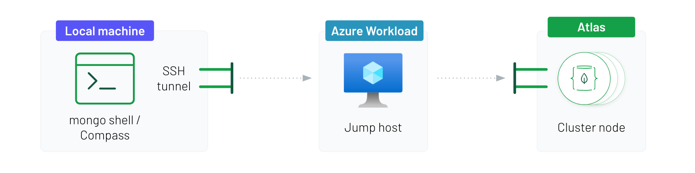

# Atlas on Azure Terraform Script
This is a script that deploys a single/multi-region Atlas cluster on Azure with Private Link and Encryption at Rest enabled.

It deploys not just Atlas resources but also Azure resources where needed, such as Private Endpoint(s) and Key Vault. And configures these as securely as possible, e.g. network ACLs for Key Vault to only allow access from Atlas shared and cluster IPs.

## Requirements
- Terraform 0.12+

## Prerequisites
- Existing [Atlas Organization](https://docs.atlas.mongodb.com/tutorial/create-atlas-account/#create-an-service-organization-and-project) with:
  - Existing [Atlas Project](https://docs.atlas.mongodb.com/tutorial/manage-projects/#create-a-project) with:
    - Existing [Project API Key](https://docs.atlas.mongodb.com/configure-api-access/#manage-programmatic-access-to-one-project) with Project Owner permissions
- Existing Azure subscription with:
  - Existing Resource group with:
    - Existing Virtual Network and Subnet
  - [Registered an Application](https://docs.microsoft.com/en-us/azure/active-directory/develop/quickstart-register-app) in Azure Active Directory with a Client Secret for creating and modifying Azure Key Vault

It’s assumed that there is an existing Azure Subscription with an existing Resource Group, Virtual Net and Subnet for the application. It’s recommended to keep the creation of these resources separate from the Atlas Terraform script, as these resources pertain to the application.

## What Resources the Script Creates
In Azure:
- Creates a new Resource Group¹. And within this group:
  - Creates a Private Endpoint¹
  - Creates a Private Service Connection¹ that is linked with the Private Endpoint in Atlas
- Creates (part of above Resource Group) or manages existing Key Vault. And configures it as follows:
  - Assigns Key Vault Reader role to Service Principal
  - Configures network ACLs to only allow access from selected IPs: [Atlas control plane](https://docs.atlas.mongodb.com/setup-cluster-security/#required-inbound-access), server running Terraform scripts and Atlas cluster IPs
  - Sets Key Vault Access Policy for Service Principal to allow retrieving, listing, encrypting and decrypting
  - Generates a new Encryption Key

In Atlas:
- Configures Encryption at Rest with encryption key managed by Azure Key Vault for existing Atlas Project
- Creates a new Atlas cluster in existing Atlas project
- Creates database user with assigned roles
- Creates a Private Endpoint¹ in Atlas and links it with Private Endpoint in Azure
- Resolves Atlas cluster hostnames to IPs to set Azure Key Vault network ACLs

¹Creates multiple in case of a multi-region cluster

## Script Contents
- `apply.sh`: wrapper script to deploy all resources
- `destroy.sh`: wrapper script to destroy all resources
- `main.tf`: main module, references all of the modules
- `/modules/atlas_clusters`: creates Atlas cluster and enables Encryption at Rest on cluster-level
- `/modules/atlas_projects`: configures Encryption at Rest on project-level in Atlas and creates DB user
- `/modules/azure_keyvault`: creates or manages existing Azure Key Vault; assigns Key Vault Reader role to Service Principal; generates Atlas encryption key; configures Key Vault’s access policies and network ACLs
- `/modules/azure_resourcegroups`: creates Azure Resource Group that holds Key Vault and Private Endpoint(s)
- `/modules/private_link`: creates Private Endpoint(s) in Atlas and Azure and configures Private Link

All modules (including main) have `outputs.tf` & `variables.tf` files for the variables that are used/outputted.

## Configuring Terraform Script
-------------------------------
### Set Atlas Project API Key 
Set your Atlas Project API Key via environment variables on the machine where you run Terraform:
```bash
$ export MONGODB_ATLAS_PUBLIC_KEY="xhzigzut"
$ export MONGODB_ATLAS_PRIVATE_KEY="79bd28d0-f8ee-4c6..."
```

### Configure Atlas Cluster
In `variables.tf`:
- Line 31: [Region](https://registry.terraform.io/providers/mongodb/mongodbatlas/latest/docs/resources/cluster#region_name) of Atlas cluster. This needs to be repeated for each region in case of a multi-region cluster. It’s highly recommended to start with a single region first to make sure everything works before moving to more advanced configurations. See Multi-region Clusters for instructions on multi-region clusters
- Line 92: [ID](https://registry.terraform.io/providers/mongodb/mongodbatlas/latest/docs/resources/project#id) of existing Atlas Project
- Line 97: [Name](https://registry.terraform.io/providers/mongodb/mongodbatlas/latest/docs/resources/cluster#name) of Atlas cluster to create 
- Line 102: [Type](https://registry.terraform.io/providers/mongodb/mongodbatlas/latest/docs/resources/cluster#cluster_type) of Atlas cluster (replica set or sharded)

For additional [arguments](https://registry.terraform.io/providers/mongodb/mongodbatlas/latest/docs/resources/cluster#argument-reference) that can be configured, see lines 32-35 of `variables.tf`.
 
In `modules/atlas_clusters/variables.tf`:
- Line 24: [Cluster tier](https://registry.terraform.io/providers/mongodb/mongodbatlas/latest/docs/resources/cluster#provider_instance_size_name)
- Line 29: [Disk type name](https://registry.terraform.io/providers/mongodb/mongodbatlas/latest/docs/resources/cluster#provider_disk_type_name). Uses names of [Azure Premium Disks](https://docs.microsoft.com/en-us/azure/virtual-machines/disks-types#disk-size-1)
- Line 39: [Major version](https://registry.terraform.io/providers/mongodb/mongodbatlas/latest/docs/resources/cluster#mongo_db_major_version) of MongoDB to use
- Line 44: Enable/disable [Cloud Provider Snapshot Backups](https://registry.terraform.io/providers/mongodb/mongodbatlas/latest/docs/resources/cluster#provider_backup_enabled)

For additional [arguments](https://registry.terraform.io/providers/mongodb/mongodbatlas/latest/docs/resources/cluster#argument-reference) that can be configured, see `variables.tf` and `atlas_clusters.tf` in `modules/atlas_clusters`.

### Configure MongoDB Database User
In modules/atlas_projects/variables.tf:
- Line 23: Database [username](https://registry.terraform.io/providers/mongodb/mongodbatlas/latest/docs/resources/database_user#username)
- Line 28: Database [password](https://registry.terraform.io/providers/mongodb/mongodbatlas/latest/docs/resources/database_user#password)
- Line 33: Assigned [role](https://registry.terraform.io/providers/mongodb/mongodbatlas/latest/docs/resources/database_user#role_name) for user
- Line 38: [Name of database](https://registry.terraform.io/providers/mongodb/mongodbatlas/latest/docs/resources/database_user#database_name) role is assigned to

Additional [database users](https://registry.terraform.io/providers/mongodb/mongodbatlas/latest/docs/resources/database_user) and [roles](https://registry.terraform.io/providers/mongodb/mongodbatlas/latest/docs/resources/database_user#roles) can be configured in `modules/atlas_projects/atlas_projects.tf`.

Passwords can be moved into either environment variables or in a separate .tfvars file so passwords don’t end up in source control.

### Configure Existing Azure Key Vault
For **EXISTING** Key Vaults only (continue to Configure New Key Vault if not using existing Key Vault): 
- Run terraform import:
```bash
$ terraform import module.azure_keyvault.azurerm_key_vault.iac_keyvault /subscriptions/00000000-0000-0000-0000-000000000000/resourceGroups/RESOURCE_GROUP/providers/Microsoft.KeyVault/vaults/KEYVAULT_NAME
```
Make sure to change the *Subscription ID*, *Resource Group*- and *Key Vault* name before running.

In `modules/azure_keyvault/variables.tf`:
- Line 3: [Name](https://registry.terraform.io/providers/hashicorp/azurerm/latest/docs/resources/key_vault#name) of Azure Key Vault to create
- Line 8: [Object ID](https://registry.terraform.io/providers/hashicorp/azurerm/latest/docs/resources/key_vault_access_policy#object_id) of Service Principal used by Atlas to read the encryption key
- Line 14: Uncomment line. [Name](https://registry.terraform.io/providers/hashicorp/azurerm/latest/docs/resources/key_vault#resource_group_name) of Resource Group the existing Key Vault is part of 
- Line 20: Uncomment line. [Location](https://registry.terraform.io/providers/hashicorp/azurerm/latest/docs/resources/key_vault#location) of existing Key Vault

In `modules/atlas_projects/variables.tf`:
- Line 63: Client [secret](https://registry.terraform.io/providers/mongodb/mongodbatlas/latest/docs/resources/encryption_at_rest#secret) associated with Service Principal
- Line 68: [App/client ID](https://registry.terraform.io/providers/mongodb/mongodbatlas/latest/docs/resources/encryption_at_rest#client_id) of Service Principal used by Atlas to read the encryption key

Check if configured properly by running: 
```bash
$ terraform plan -target=module.azure_keyvault.azurerm_key_vault.iac_keyvault
```
This should return:
```
Plan: 0 to add, 1 to change, 0 to destroy
```
If something else is returned, inspect plan details and adjust configuration accordingly.

Additional [settings](https://registry.terraform.io/providers/hashicorp/azurerm/latest/docs/resources/key_vault) of the Key Vault can be configured in `modules/azure_keyvault/azure_keyvault.tf`.

### Configure New Azure Key Vault
For **NEW** (to be created) Key Vaults only:

In `modules/azure_keyvault/variables.tf`:
- Line 3: [Name](https://registry.terraform.io/providers/hashicorp/azurerm/latest/docs/resources/key_vault#name) of Azure Key Vault to create
- Line 8: [Object ID](https://registry.terraform.io/providers/hashicorp/azurerm/latest/docs/resources/key_vault_access_policy#object_id) of Service Principal used by Atlas to read the encryption key

Additional [settings](https://registry.terraform.io/providers/hashicorp/azurerm/latest/docs/resources/key_vault) of the Key Vault can be configured in `modules/azure_keyvault/azure_keyvault.tf`.

### Configure Azure Resource Group
In `variables.tf`:
- Line 24: [Location](https://registry.terraform.io/providers/hashicorp/azurerm/latest/docs/resources/resource_group#location) of Resource Group to create and of resources part of this group
- Line 30: [Name](https://registry.terraform.io/providers/hashicorp/azurerm/latest/docs/resources/resource_group#name) of Azure Resource Group to create that will hold the Private Endpoint

- Line 25: [Name](https://registry.terraform.io/providers/hashicorp/azurerm/latest/docs/resources/resource_group#name) of existing Azure Resource Group
- Line 26: [Name](https://registry.terraform.io/providers/hashicorp/azurerm/latest/docs/resources/virtual_network#name) of existing Virtual Network
- Line 27: [Name](https://registry.terraform.io/providers/hashicorp/azurerm/latest/docs/resources/subnet#name) of existing Subnet. Used by Private Endpoint that is linked to Atlas Private Endpoint

The above needs to be repeated for each location/region in case of a Multi-region Cluster.

### Configure Azure Private Link
In `variables.tf`:
- Line 28: [Name](https://registry.terraform.io/providers/hashicorp/azurerm/latest/docs/resources/private_endpoint#name) of Azure Private Endpoint
- Line 29: [Name](https://registry.terraform.io/providers/hashicorp/azurerm/latest/docs/resources/private_endpoint#name) of Private Service Connection

The above needs to be repeated for each location/region in case of a Multi-region Cluster

### Configure Multi-region
The script is configured for single-region deployments by default. Skip this step for single-region clusters. For multi-region clusters follow the instructions below.

In `main.tf`:
- Uncomment lines 119-169

In `variables.tf`:
- Comment lines 23-36
- Uncomment lines 40-81
- Configure the Atlas Cluster, Azure Resource Group and Private Link for each region
- Line 102: Change cluster tier if needed, see Replica Set vs Sharded

Make sure to run `terraform init` after making the above changes.

FYI: Terraform 0.12 doesn’t allow use of `for_each` with module blocks, which could prevent having to (un)comment blocks and have them be generated from input variables instead.

#### Replica Set vs Sharded for Multi-region Clusters
Atlas does not allow more than 1 PE per region for multi-region clusters when it’s a replica set. See [Private Endpoint Limitations](https://docs.atlas.mongodb.com/security-private-endpoint/#limitations). As a workaround, you can create a sharded cluster which does not have this limitation. Single region clusters do not have this limitation and can always be a replica set.

Multi-region clusters that are a replica set require the regions in Azure to be peered. If this is not possible you can deploy a sharded cluster as an alternative, as this does not require regions to be peered.

If you do not need sharding for other reasons (horizontal scaling, global clusters, etc.), make sure to deploy the cluster with only 1 shard. A single-shard cluster is essentially a replica set with mongos (query router) in front of it, which handles incoming connections from the Private Endpoint.

When using a sharded multi-region cluster with Private Link, you will need to enable [Regionalized Private Endpoints](https://docs.atlas.mongodb.com/security-private-endpoint/#regionalized-private-endpoints-for-multi-region-sharded-clusters) before you can obtain your cluster's connection string.

### Add Terraform Server IP Addresses
In `variables.tf`:
- Line 116: Add the IP address of the server running Terraform
Can also be supplied through .tfvars file or through command-line with:
```bash
-var="terraform_server_ip=123.123.123.123"
```

Without this, you will get a 403 error when setting Azure Key Vault policies.

### Running Terraform
- `terraform init`
- Start Terraform with the accompanied scripts:
  - `apply.sh`
  - `destroy.sh`

Do **NOT** use `terraform apply`

This script assumes Network ACLs are used in Azure Key Vault to only allow access from configured IPs. This requires the Atlas cluster to be created with encryption disabled so we can get the cluster IPs, and then update the Key Vault's Network ACLs and enable cluster-encryption.

All of this is done through the control script which runs `terraform apply` with `-target` to create the Atlas cluster only, and get the cluster IP addresses on a subsequent run and create all other resources, and finally run `terraform apply` with `-target` again to enable Atlas cluster-encryption.

## Connecting to Atlas Cluster
------------------------------
First, obtain your Atlas [connection string](https://docs.mongodb.com/guides/cloud/connectionstring/) and make sure to select the [Private Endpoint](https://docs.atlas.mongodb.com/security-private-endpoint/#connect-to-service-using-a-private-endpoint) connection type while doing this. This connection string can be used by the application. For connecting from your local machine please read below.

### Connecting From Your Local Machine
Due to the usage of Private Link, it is only possible to connect to the Atlas cluster via a host that sits inside your Azure Subscription, and that is part of or peered with the Virtual Network that contains the Private Endpoint that is linked with Atlas.

To connect to Atlas from your local machine, set up a jumphost in your Azure Subscription that can serve as an SSH tunnel to Atlas.



```bash
ssh -L <local_port>:<mongodb_hostname>:<mongodb_port> <user>@<bastion_hostname> -fN
```
If you have a deployment running on `hostname-a.com` on port `1024`, and the bastion host is `hostname-b.com` with username `root`, you can build the tunnel via:
```bash
ssh -L 27000:hostname-a.com:1024 root@hostname-b.com -fN
```
Using this SSH tunnel, you can now connect Compass (or the mongo shell) to `localhost:27000` to connect to the deployment running on `hostname-a.com`, e.g. `mongo root@localhost:27000`